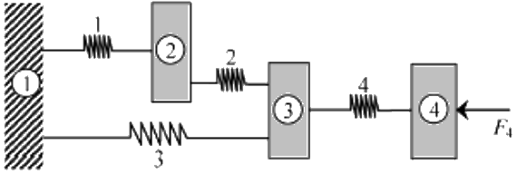

# Exercício 1

**Aluno:** Rafael Lúcio Negrão Cordeiro<br/>
**Matrícula:** 201310323<br/>
**Disciplina:** CET961 - Engenharia Assistida por Computador

---
1. Tres corpos rígidos, identificados por 2, 3, e 4, estao unidos por quatro molas, conforma mostra a Fig. 1. Uma força horizontal de 1.000 N é aplicada ao corpo 4. Encontre os deslocamentos dos tres corpos e as forças (traçao/compressao) nas molas. Qual é a reaçao na parede? Admita que os corpos só possam sofrer translaçao na direçao horizontal. As constantes de mola (N/mm) sao: $K_1 = 400$, $K_2 = 500$, $K_3 = 500$ e $K_4 = 300$.


<span class="caption">Figura 1: Estrutura da questao 1</span>
```python
k1 = 400 # N / mm
k2 = 500 # N / mm
k3 = 500 # N / mm
k4 = 300 # N / mm

f4 = 1000 # N

u1 = 0 # Unidade de deslocamento
```

#### Compondo o sistema na notaçao matricial $[K^{(g)}]\{U^{(g)}\} = \{F^{(g)}\}$, temos:

$$
\overbrace{
    \begin{bmatrix}
        k_1+k_3 & -k_1 & -k_3 & 0\\
        -k_1 & k_1+k_2 & -k_2 & 0\\
        -k_3 & -k_2 & k_2+k_3+k_4 & -k_4\\
        0 & 0 & -k_4 & k_4
    \end{bmatrix}
}^{[K^{(g)}]}
\overbrace{
    \begin{Bmatrix}
        u_1\\
        u_2\\
        u_3\\
        u_4
    \end{Bmatrix}
}^{\{U^{(g)}\}}
=
\overbrace{
    \begin{Bmatrix}
        f_1\\
        f_2\\
        f_3\\
        f_4
    \end{Bmatrix}
}^{\{F^{(g)}\}}
$$

Onde, substituindo, temos:

$$
\begin{bmatrix}
    400+500 & -400 & -500 & 0\\
    -400 & 400+500 & -500 & 0\\
    -500 & -500 & 500+500+300 & -300\\
    0 & 0 & -300 & 300
\end{bmatrix}\begin{Bmatrix}
    0\\
    u_2\\
    u_3\\
    u_4
\end{Bmatrix}
=
\begin{Bmatrix}
    R_1\\
    0\\
    0\\
    1000
\end{Bmatrix}
$$
#### Ao executar as multiplicações das matrizes, temos:
$$
\begin{cases}
    -400u_2 - 500u_3 = R_1\\
    900u_2 - 500u_3 = 0\\
    -500u_2 + 1300u_3 -300u_4 = 0\\
    0u_2 - 300u_3 + 300u_4= 1000
\end{cases}
$$

Se isolarmos todas as variáveis para o lado esquerdo da equaçao, teremos:
$$
\begin{cases}
    -400u_2 - 500u_3 + 0u_4 - R_1 = 0\\
    900u_2 - 500u_3 + 0u_4 + 0R_1 = 0\\
    -500u_2 + 1300u_3 - 300u_4 + 0R_1 = 0\\
    0u_2 - 300u_3 + 300u_4 + 0R_1 = 1000
\end{cases}
$$

Da algebra linear, verifica-se que pode-se resolver um sistema de 4 equaçoes com 4 variáveis com uma matriz de seus coeficientes:

$$
\begin{bmatrix}
    -400 & -500 & 0 & -1\\
    900 & -500 & 0 & 0\\
    -500 & 1300 & -300 & 0\\
    0 & -300 & 300 & 0
\end{bmatrix}
\begin{bmatrix}
    u_2\\
    u_3\\
    u_4\\
    R_1
\end{bmatrix}
=
\begin{bmatrix}
    1\\
    0\\
    0\\
    1000
\end{bmatrix}
$$

Existe uma biblioteca no python dedicada a resolver equações organizadas na forma matricial acima. No pacote numpy, módulo de algebra linear. O código a seguir criará os vetores da matriz acima e executará o módulo de algebra linear do numpy, já entregando os resultados.

```python
import numpy as np

# coeffs de coeficientes
coeffs = [[-400, -500,    0, -1],
          [900, -500,    0,  0],
          [-500, 1300, -300,  0],
          [  0, -300,  300,  0]]

# image de conjunto imagem de uma função
image = [1, 0, 0, 1000]

# Transformando os vetores nativos python em vetores numpy
coeffs = np.array(coeffs)
image = np.array(image)
```
```python
# Visualizando o conteúdo dos vetores

coeffs, image

(array([[-400, -500,    0,   -1],
        [ 900, -500,    0,    0],
        [-500, 1300, -300,    0],
        [   0, -300,  300,    0]]),
        array([   1,    0,    0, 1000]))
```
```python
# Resolvendo ele com o módulo de álgebra linear

variaveis = np.linalg.solve(coeffs, image)

print('Os resultados são: u2 = %.2em, u3 = %.2em, u4 = %.2em e f1 = %.2eN' % tuple(variaveis))
```
