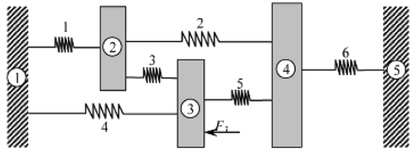

# Lista 1 - Exercício 3

**Aluno:** Rafael Lúcio Negrão Cordeiro<br/>
**Matrícula:** 201310323<br/>
**Disciplina:** CET961 - Engenharia Assistida por Computador

---
3. Veja o sistema massa-mola descrito no exercício 2. Que força $F_2$ deve ser aplicada ao corpo 2 para evitar que ele se mova? Como isso influirá nas reaçoes de apoio? Sugestao: Imponha a condiçao de contorno $u_2 = 0$ no MEF e encontre os deslocamentos $u_3$ e $u_4$. A seguir, a força $F_2$ será a reaçao no nó 2.

<span class="caption">Figura 2: Estrutura das questao 2 e 3</span>
```python
k1 = 500 # N / mm
k2 = 400 # N / mm
k3 = 600 # N / mm
k4 = 200 # N / mm
k5 = 400 # N / mm
k6 = 300 # N / mm

f3 = 1000 # N

u1 = u5 = 0

u1 = u4 = 0 # Unidade de deslocamento
```

#### Compondo o sistema na notaçao matricial $[K^{(g)}]\{U^{(g)}\} = \{F^{(g)}\}$, temos:

$$
\overbrace{
    \begin{bmatrix}
        k_1 + k_4 & -k_1 & -k_4 & 0 & 0\\
        -k_1 & k_1 + k_2 + k_3 & -k_3 & -k_2 & 0\\
        -k_4 & -k_3 & k_3 + k_4 + k_5 & -k_5 & 0\\
        0 & -k_2 & -k_5 & k_2 + k_5 + k_6 & -k_6\\
        0 & 0 & 0 & -k_6 & k_6
    \end{bmatrix}
}^{[K^{(g)}]}
\overbrace{
    \begin{Bmatrix}
        u_1\\
        u_2\\
        u_3\\
        u_4\\
        u_5
    \end{Bmatrix}
}^{\{U^{(g)}\}}=\overbrace{
    \begin{Bmatrix}
        f_1\\
        f_2\\
        f_3\\
        f_4\\
        f_5
    \end{Bmatrix}
}^{\{F^{(g)}\}}
$$
Onde, considerando que queremos apenas os deslocamentos dos corpos e as forças nas paredes, temos:
$$
\begin{bmatrix}
    700 & -500 & -200 & 0 & 0\\
    -500 & 1500 & -600 & -400 & 0\\
    -200 & -600 & 1200 & -400 & 0\\
    0 & -400 & -400 & 1100 & -300\\
    0 & 0 & 0 & -300 & 300
\end{bmatrix}
\begin{Bmatrix}
    0\\
    0\\
    u_3\\
    u_4\\
    0
\end{Bmatrix}=\begin{Bmatrix}
    R_1\\
    R_2\\
    1000\\
    0\\
    R_5
\end{Bmatrix}
$$

#### Ao executar as multiplicações das matrizes, temos:
$$
\begin{cases}
    -200u_3 = R_1\\
    -600u_3 - 400u_4 = R_2\\
    1200u_3 - 400u_4 = 1000\\
    -400u_3 + 1100u_4= 0\\
    -300u_4 = R5
\end{cases}
$$

Se isolarmos todas as variáveis para o lado esquerdo da equaçao, teremos:
$$
\begin{cases}
   -200u_3 + 0u_4 - R_1 + 0R_2 + 0R_5 = 0\\
   -600u_3 - 400u_4 + 0R_1 + -R_2 + 0R_5 = 0\\
   1200u_3 - 400u_4 + 0R_1 + 0R_2 + 0R_5 = 1000\\
   -400u_3 + 1100u_4 + 0R_1 + 0R_2 - 0R_5 = 0\\
    0u_3 -300u_4 + 0R_1 + 0R_2 - R_5 = 0
\end{cases}
$$

Da algebra linear, verifica-se que pode-se resolver um sistema de 4 equaçoes com 4 variáveis com uma matriz de seus coeficientes:

$$
\begin{bmatrix}
    -200 & 0 & -1 & 0 & 0\\
    -600 & -400 &  0 & -1 & 0\\
    1200 & -400 & 0 & 0 & 0\\
    -400 & 1100 & 0 & 0 & 0\\
      0  &  -300 & 0 & 0 & -1
\end{bmatrix}
\begin{bmatrix}
    u_3\\
    u_4\\
    R_1\\
    R_2\\
    R_5
\end{bmatrix}
=
\begin{bmatrix}
    0\\
    0\\
    1000\\
    0\\
    0
\end{bmatrix}
$$

Existe uma biblioteca no python dedicada a resolver equações organizadas na forma matricial acima. No pacote numpy, módulo de algebra linear. O código a seguir criará os vetores da matriz acima e executará o módulo de algebra linear do numpy, já entregando os resultados.

```python
import numpy as np

# coeffs de coeficientes
coeffs = [[-200,    0, -1,  0,  0],
          [-600, -400,  0, -1,  0],
          [1200, -400,  0,  0,  0],
          [-400, 1100,  0,  0,  0],
          [   0, -300, -0,  0, -1]]

# image de conjunto imagem de uma funç~ao
image = [0, 0, 1000, 0, 0]

# Transformando os vetores nativos python em vetores numpy
coeffs = np.array(coeffs)
image = np.array(image)
```

```python
# Visualizando o conteúdo dos vetores

coeffs, image

(array([[-200,    0,   -1,    0,    0],
        [-600, -400,    0,   -1,    0],
        [1200, -400,    0,    0,    0],
        [-400, 1100,    0,    0,    0],
        [   0, -300,    0,    0,   -1]]),
 array([   0,    0, 1000,    0,    0]))
```

```python
# Resolvendo ele com o módulo de álgebra linear

variaveis = np.linalg.solve(coeffs, image)

print('Os resultados são: u3 = %.2emm, u4 = %.2emm, f1 = %.2eN, f2 = %.2eN e f5 = %.2eN' % tuple(variaveis))
```
<span class="caption">Os resultados são: $u_3 = 9.48 \cdot 10^{-1} mm$, $u_4 = 3.45 \cdot 10^{-1} mm$, $f_1 = -1.90 \cdot 10^{2} N$, $f_2 = -7.07 \cdot 10^{2} N$ e $f_5 = -1.03 \cdot 10^{2} N$
</span>
