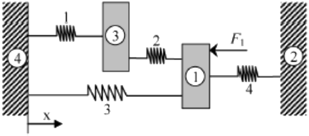

# Exercício 4

**Aluno:** Rafael Lúcio Negrão Cordeiro<br/>
**Matrícula:** 201310323<br/>
**Disciplina:** CET961 - Engenharia Assistida por Computador

---

1. Quatro corpos rígidos (1, 2, 3 e 4) estao unidos a quatro molas conforme mostra a Fig 3. Uma força horizontal de $1.000 N$ é aplicada ao corpo 1. Usando a análise de MEF, encontre:
	1. os deslocamentos dos dois corpos (1 e 3);
	2. encontre a força nos elementos (traçao e  compressao) da mola1;
	3. as forças de reaçao na parede direita (corpo 2).


<span class="caption">Figura 3: Estrutura da questao 4</span>

Admita que os corpos só possam sofrer translaçao na direçao horizontal. As constantes de mola (N/mm) sao: $K_1 = 400$, $K_2 = 500$, $K_3 = 500$ e $K_4 = 300$.

```python
k1 = 400 # N / mm
k2 = 500 # N / mm
k3 = 500 # N / mm
k4 = 300 # N / mm

f1 = 1000 # N

u4 = u2 = 0
```


#### Compondo o sistema na notaçao matricial $[K^{(g)}]\{U^{(g)}\} = \{F^{(g)}\}$, temos:

$$
\overbrace{
    \begin{bmatrix}
        k_2 + k_3 + k_4 & -k_4 & -k_2 & -k_3\\
        -k_4 & k_4 & 0 & 0 \\
        -k_2 & 0 & k_1 + k_2 & -k_1\\
        -k_3 & 0 & -k_1 & k_1 + k_3
    \end{bmatrix}
}^{[K^{(g)}]}
\overbrace{
    \begin{Bmatrix}
        u_1\\
        u_2\\
        u_3\\
        u_4
    \end{Bmatrix}
}^{\{U^{(g)}\}}=\overbrace{
    \begin{Bmatrix}
        f_1\\
        f_2\\
        f_3\\
        f_4
    \end{Bmatrix}
}^{\{F^{(g)}\}}
$$
Onde, considerando que queremos apenas os deslocamentos dos corpos e as forças nas paredes, temos:
$$
\begin{bmatrix}
    1300 & -300 & -500 & -500\\
    -300 & 500 & 0 & 0\\
    -500 & 0 & 900 & -400\\
    -500 & 0 & -400 & 900
\end{bmatrix}
\begin{Bmatrix}
    u_1\\
    0\\
    u_3\\
    0
\end{Bmatrix}=\begin{Bmatrix}
    1000\\
    R_2\\
    0\\
    R_4
\end{Bmatrix}
$$

#### Ao executar as multiplicações das matrizes, temos:
$$
\begin{cases}
    1300u_1 - 500u_3= 1000\\
    -300u_1 = R_2\\
    -500u_1 + 900u_3 = 0\\
    -500u_1 - 400u_4 = R_4
\end{cases}
$$

Se isolarmos todas as variáveis para o lado esquerdo da equaçao, teremos: 
$$
\begin{cases}
   1300u_1 - 500u_3 - 0R_2 + 0R_4 = 1000\\
   -300u_1 + 0u_3 - R_2 + 0R_4 = 0\\
   -500u_1 + 900u_3 + 0R_2 + 0R_4 = 0\\
   -500u_1 - 400u_3 + 0R_2 - R_4 = 0
\end{cases}
$$

Da algebra linear, verifica-se que pode-se resolver um sistema de 4 equaçoes com 4 variáveis com uma matriz de seus coeficientes:

$$
\begin{bmatrix}
    1300 & -500 & 0 & 0\\
    -300 & 0 & -1 & 0\\
    -500 & 900 & 0 & 0\\
    -500 & -400 & 0 & -1
\end{bmatrix}
\begin{bmatrix}
    u_1\\
    u_3\\
    R_2\\
    R_4
\end{bmatrix}
=
\begin{bmatrix}
    1000\\
    0\\
    0\\
    0
\end{bmatrix}
$$

Existe uma biblioteca no python dedicada a resolver equações organizadas na forma matricial acima. No pacote numpy, módulo de algebra linear. O código a seguir criará os vetores da matriz acima e executará o módulo de algebra linear do numpy, já entregando os resultados.

```python
import numpy as np

# coeffs de coeficientes
coeffs = [[1300, -500,  0,  0],
          [ -300,    0, -1,  0],
          [ -500,  900,  0,  0],
          [ -500, -400,  0, -1]]

# image de conjunto imagem de uma funç~ao
image = [1000, 0, 0, 0]

# Transformando os vetores nativos python em vetores numpy
coeffs = np.array(coeffs)
image = np.array(image)
```

```python
# Visualizando o conteúdo dos vetores

coeffs, image
```

```python
(array([[1300, -500,    0,    0],
        [-300,    0,   -1,    0],
        [-500,  900,    0,    0],
        [-500, -400,    0,   -1]]),
         array([1000,    
         		   0,    
         		   0,    
         		   0]))
```

```python
# Resolvendo ele com o módulo de álgebra linear

variaveis = np.linalg.solve(coeffs, image)

print('Os resultados são: u1 = %.2emm, u3 = %.2e-2mm, f4 = %.2eN, f2 = %.2eN' % tuple(variaveis))
```
<span class="caption">Os resultados são: u1 = 9.78e-01mm, u3 = 5.43e-01-2mm, f4 = -2.93e+02N, f2 = -7.07e+02N
</span>