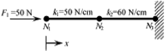

# Lista 1 - Exercício 5

**Aluno:** Rafael Lúcio Negrão Cordeiro<br/>
**Matrícula:** 201310323<br/>
**Disciplina:** CET961 - Engenharia Assistida por Computador

---
1. Determine os deslocamentos nodais e as forças de reaçao (Fig. 4) usando o método direto de rigidez. Calcule os deslocamentos nodais e as forças nos elementos.


<span class="caption">Figura 4: Estrutura da questao 5</span>

```python
k1 = 50 # N / cm
k2 = 60 # N / cm

f1 = 50 # N

u3  = f2 = 0
```

#### Compondo o sistema na notaçao matricial $[K^{(g)}]\{U^{(g)}\} = \{F^{(g)}\}$, temos:

$$
\overbrace{
    \begin{bmatrix}
        k_1 & -k_1 & 0\\
       -k_1 & k_1 + k_2 & -k_2\\
        0 & -k_2 & k_2
    \end{bmatrix}
}^{[K^{(g)}]}
\overbrace{
    \begin{Bmatrix}
        u_1\\
        u_2\\
        u_3
    \end{Bmatrix}
}^{\{U^{(g)}\}}=\overbrace{
    \begin{Bmatrix}
        f_1\\
        f_2\\
        f_3
    \end{Bmatrix}
}^{\{F^{(g)}\}}
$$
Onde, considerando que queremos apenas os deslocamentos dos corpos e as forças nas paredes, temos:
$$
\begin{bmatrix}
    50 & -50 & 0\\
    -50 & 110 & -60\\
    0 &  -60 & 60
\end{bmatrix}
\begin{Bmatrix}
    u_1\\
    u_2\\
    0
\end{Bmatrix}=\begin{Bmatrix}
    50\\
    0\\
    R_3
\end{Bmatrix}
$$

#### Ao executar as multiplicações das matrizes, temos:
$$
\begin{cases}
     50u_1 -  50u_2= 50\\
     -50u_1 + 110u_2= 0\\
     -60u_2 = R_3
\end{cases}
$$

Se isolarmos todas as variáveis para o lado esquerdo da equaçao, teremos:
$$
\begin{cases}
    50u_1 -  50u_2 + 0R_3 = 50\\
    -50u_1 + 110u_2 + 0R_3 = 0\\
     0u_1 -  60u_2 - 1R_3 = 0
\end{cases}
$$

Da algebra linear, verifica-se que pode-se resolver um sistema de 2 equaçoes com 2 variáveis com uma matriz de seus coeficientes:

$$
\begin{bmatrix}
    50 & -50 & 0\\
    -50 &  110 & 0\\
    0  & -60 & -1
\end{bmatrix}
\begin{bmatrix}
    u_1\\
    u_2\\
    R_3
\end{bmatrix}
=
\begin{bmatrix}
    50\\
    0\\
    0
\end{bmatrix}
$$

Existe uma biblioteca no python dedicada a resolver equações organizadas na forma matricial acima. No pacote numpy, módulo de algebra linear. O código a seguir criará os vetores da matriz acima e executará o módulo de algebra linear do numpy, já entregando os resultados.

```python
import numpy as np

# coeffs de coeficientes
coeffs = [[k1,   -k1,    0],
          [-k1, k1 + k2, 0],
          [0,    -k2,   -1]]

# image de conjunto imagem de uma funç~ao
image = [50, 0, 0]

# Transformando os vetores nativos python em vetores numpy
coeffs = np.array(coeffs)
image = np.array(image)
```

```python
# Visualizando o conteúdo dos vetores

coeffs, image
```

```python
(array([[ 50, -50,   0],
        [-50, 110,   0],
        [  0, -60,  -1]]),
        array([50,
        		0,
        		0]))
```

```python
# Resolvendo ele com o módulo de álgebra linear

variaveis = np.linalg.solve(coeffs, image)

print('Os resultados são: u1 = %.2ecm, u2 = %.2ecm, R3 = %.2eN' % tuple(variaveis))
```
<span class="caption">Os resultados são: $u_1 = 1.83e+00 cm$, $u_2 = 8.33 \cdot 10^{-1} cm$, $R_3 = -5.00 N$</span>
