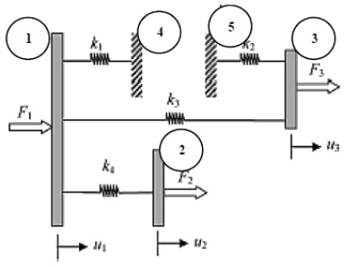
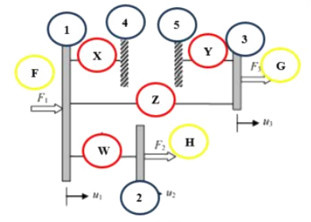

# Lista 1 - Exercício 6

**Aluno:** Rafael Lúcio Negrão Cordeiro 
**Matrícula:** 201310323 
**Disciplina:** CET961 - Engenharia Assistida por Computador

---
1. Na estrutuda mostrada na Fig. 5 os blocos rígidos estao unidos a molas lineares. Imagine que só sao permitidos deslocamentos horizontais. Escreva as equaçoes de equilíbrio global $[K]\{U\} = \{F\}$ depois de aplicar as condiçoes de contorno em deslocamentos em termos das rigidezas das molas, $k_i$, dos graus de liberdade $(GLs)$, $u_i$, e das cargas aplicadas $F_i$.

    

    Figura 5: Estrutura da questao 6

    Observaçao: A indentificaçao dos nós, elementos e forças externas estao conforme Fig. 6.

    - Identificaçao em *vermelho*: elementos;
    - Identificaçao em *azul*: nós;
    - Identificaçao em *amarelo*: forças.

    

    Figura 6: Ilustraçao da questao 6

#### Compondo o sistema na notaçao matricial $[K^{(g)}]\{U^{(g)}\} = \{F^{(g)}\}$, temos:

$$
\overbrace{
    \begin{bmatrix}
        -(k_1 + k_3 + k_4) & -k_4 & k_3 & -k_1 & 0\\
        -k_4 & k_4 & 0 & 0 & 0\\
        k_3 & 0 & k_2 + k_3 & -k_2 & 0\\
        -k_1 & 0 & 0 & k_1 & 0\\
        0 & 0 & 0 & -k_2 & k_2
    \end{bmatrix}
}^{[K^{(g)}]}
\overbrace{
    \begin{Bmatrix}
        u_1\\
        u_2\\
        u_3\\
        u_4
    \end{Bmatrix}
}^{\{U^{(g)}\}}=\overbrace{
    \begin{Bmatrix}
        f_1\\
        f_2\\
        f_3\\
        f_4
    \end{Bmatrix}
}^{\{F^{(g)}\}}
$$
Onde, considerando que queremos apenas os deslocamentos dos corpos e as forças nas paredes, temos:
$$
\overbrace{
    \begin{bmatrix}
        -(k_1 + k_3 + k_4) & -k_4 & k_3 & -k_1 & 0\\
        -k_4 & k_4 & 0 & 0 & 0\\
        k_3 & 0 & k_2 + k_3 & -k_2 & 0\\
        -k_1 & 0 & 0 & k_1 & 0\\
        0 & 0 & 0 & -k_2 & k_2
    \end{bmatrix}
}^{[K^{(g)}]}
\overbrace{
    \begin{Bmatrix}
        u_1\\
        u_2\\
        u_3\\
        0\\
        0
    \end{Bmatrix}
}^{\{U^{(g)}\}}=\overbrace{
    \begin{Bmatrix}
        0\\
        0\\
        0\\
        f_4\\
        f_5
    \end{Bmatrix}
}^{\{F^{(g)}\}}
$$
