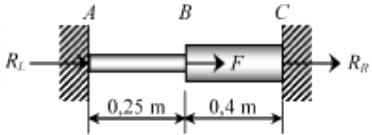

# Lista 1 - Exercício 8

**Aluno:** Rafael Lúcio Negrão Cordeiro<br/>
**Matrícula:** 201310323<br/>
**Disciplina:** CET961 - Engenharia Assistida por Computador

---
8. Utilize o MEF para determinar a força axial P em cada parte da barra uniaxial, conforme Fig. 8. Quais sao as reaçoes de apoio? Admita $E = 100 GPa$, as áreas da seçao transversal das duas partes $\underline{AB}$ e $\underline{BC}$ sao respectivamente $10^{-4}m^2$, $2 \cdot 10^{-4}m^2$ e $F = 10.000 N$. A força $F$ é aplicada na seçao transversal em $\underline{B}$.
  Observaçoes:
    a) da teoria da elasticidade temos que $k = EA/L$
    b) atençao para as unidades ($GPa$, $m$ e $N$).

  

```python
E = 100e9 # GPa
A1 = 1e-4 # m²
A2 = 2e-4 # m²

Fb = 10_000 # N

A_B = 0.25 # m
B_C = 0.40 # m

k = lambda Elastici, Area, Comprime: Elastici * Area / Comprime

k1 = k(E, A1, A_B) # N / m
k2 = k(E, A2, B_C) # N / m
```

#### Compondo o sistema na notaçao matricial $[K^{(g)}]\{U^{(g)}\} = \{F^{(g)}\}$, temos:

$$
\overbrace{
    \begin{bmatrix}
        k_{\vec{AB}} & -k_{\vec{AB}} & 0\\
        -k_{\vec{AB}} & k_{\vec{AB}} + k_{\vec{BC}} & -k_{\vec{BC}}\\
        0 & -k_{\vec{BC}} & k_{\vec{BC}}
    \end{bmatrix}
}^{[K^{(g)}]}
\overbrace{
    \begin{Bmatrix}
        u_1\\
        u_2\\
        u_3
    \end{Bmatrix}
}^{\{U^{(g)}\}}
=\overbrace{
    \begin{Bmatrix}
        f_1\\
        f_2\\
        f_3
    \end{Bmatrix}
}^{\{F^{(g)}\}}
$$
Onde, considerando que queremos apenas os deslocamentos dos corpos e as forças nas paredes, temos:
$$
\begin{bmatrix}
    k_{\vec{AB}} & -k_{\vec{AB}} & 0\\
    -k_{\vec{AB}} & k_{\vec{AB}} + k_{\vec{BC}} & -k_{\vec{BC}}\\
    0 & -k_{\vec{BC}} & k_{\vec{BC}}
\end{bmatrix}
\begin{Bmatrix}
    0\\
    u_2\\
    0
\end{Bmatrix}=\begin{Bmatrix}
    R_1\\
    F_B\\
    R_3
\end{Bmatrix}
$$

#### Ao executar as multiplicações das matrizes, temos:
$$
\begin{equation}
    \begin{cases}
        -k_{\vec{AB}}u_2 = R_1\\
        (k_{\vec{AB}} + k_{\vec{BC}})u_2 = F_B\\
        -k_{\vec{BC}}u_2 = R_3
    \end{cases}
\end{equation}
$$

Se isolarmos todas as variáveis para o lado esquerdo da equaçao, teremos: $ \begin{equation}
    \begin{cases}
       -k_{\vec{AB}}u_2 - R_1 +0R_3= 0\\
        (k_{\vec{AB}} + k_{\vec{BC}})u_2 + 0R_1 + 0R_3 = F_B\\
        -k_{\vec{BC}}u_2 + 0R_1 - R_3 = 0
    \end{cases}
\end{equation} $

Como já sabemos os valores de $k_{\vec{AB}}$, $k_{\vec{BC}}$ e $F_B$. Da algebra linear, verifica-se que pode-se resolver um sistema de 3 equaçoes com 3 variáveis com uma matriz de seus coeficientes:

$$
\begin{bmatrix}
    -k_{\vec{AB}} & -1 & 0\\
    (k_{\vec{AB}} + k_{\vec{BC}}) & 0 & 0\\
    -k_{\vec{BC}} & 0 & -1
\end{bmatrix}
\begin{bmatrix}
    0\\
    u_2\\
    0
\end{bmatrix}
=
\begin{bmatrix}
    0\\
    F_B\\
    0
\end{bmatrix}
$$

Existe uma biblioteca no python dedicada a resolver equações organizadas na forma matricial acima. No pacote numpy, módulo de algebra linear. O código a seguir criará os vetores da matriz acima e executará o módulo de algebra linear do numpy, já entregando os resultados.

```python
import numpy as np

# coeffs de coeficientes
coeffs = [[-k1, -1,  0],
          [ k1 + k2, 0, 0],
          [ k2,  0,  -1]]

# image de conjunto imagem de uma funç~ao
image = [0, Fb, 0]

# Transformando os vetores nativos python em vetores numpy
coeffs = np.array(coeffs)
image = np.array(image)
```

```python
# Visualizando o conteúdo dos vetores

coeffs, image
```

```python
(array([[-4.e+07, -1.e+00,  0.e+00],
        [ 9.e+07,  0.e+00,  0.e+00],
        [ 5.e+07,  0.e+00, -1.e+00]]), array([    0, 10000,     0]))
```

```python
# Resolvendo ele com o módulo de álgebra linear

variaveis = np.linalg.solve(coeffs, image)

print('Os resultados são: u2 = %.2em, R1 = %.2eN, R3 = %.2eN' % tuple(variaveis))
```
<span class="caption">Os resultados são: $u_2 = 1.11 \cdot 10^{-4} N$, $R_1 = -4.44 \cdot 10^3 N$ e $R_3 = 5.53 \cdot 10^3N$</span>
